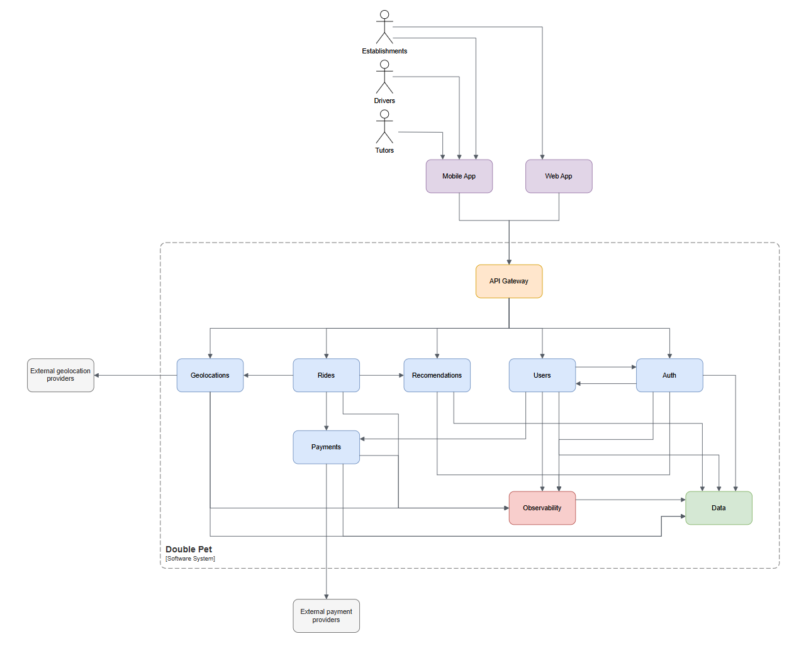
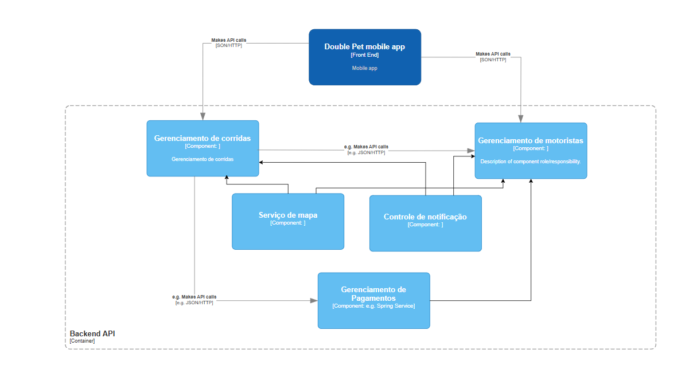
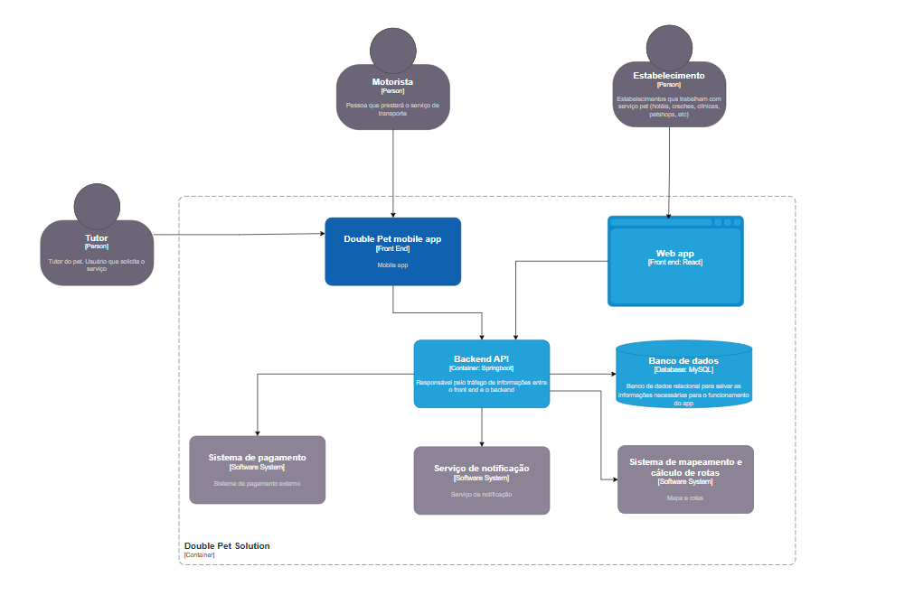
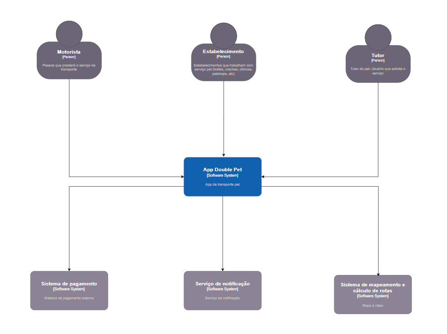

Arquitetura da escolha 

(UX, Design thinking e modern web)

Participantes: 

 
Diogo Agra Alexandria – RM353654

Luciana Corso Lunardi – RM353395

Eric Roberto do Nascimento – RM349751

Link do repositório no Github: 

Link para vídeo explicativo: 

Montar um Story Telling sobre o problema que você resolve e definir o tema (Verificar nos slides da aula 1 sobre os temas sugeridos).

Tema escolhido: Entrega/transporte por aplicativo

Story Telling:

Conectando Pessoas, Pets e Oportunidades

Imagine a Ana, tutora apaixonada pela Luna, uma Golden Retriever de olhar doce e energia quase inesgotável. Certo dia, Luna começou a apresentar sinais de desconforto e Ana precisava levá-la ao veterinário com urgência. Só que, sem um carro próprio e atarefada de sua rotina, ela se via obrigada a depender de amigos ou de serviços que nem sempre aceitavam transportar sua companheira de quatro patas. A ansiedade foi crescendo: como garantir que Luna chegaria em segurança ao local de atendimento? Como conciliar o cuidado com a pet, o tempo apertado do trabalho e um serviço de transporte confiável e acessível?

Nesse mesmo bairro, temos o Seu Joaquim, dono de um pet shop que adora receber clientes peludos. Ele sempre quer oferecer o melhor serviço e conforto para os tutores, mas percebeu que muitos deixam de agendar banho ou consultas por causa das dificuldades de locomoção, principalmente nos horários de pico. Do outro lado da cidade, Juliana, uma motorista de aplicativo experiente, busca maneiras de aumentar sua renda sem desistir de oferecer um atendimento de qualidade. Ela ama animais e já teve situações em que precisou recusar corridas porque não havia preparo ou apoio necessário para transportar pets com segurança.

É nesse contexto que surge o Double Pet, o aplicativo que conecta três pontas fundamentais: tutores, motoristas preparados e estabelecimentos pet-friendly. Imagine o alívio da Ana ao descobrir um serviço que, em poucos cliques, garante um carro que aceita levar Luna — com conforto, cuidado e preço justo. Ela pode acompanhar todo o trajeto em tempo real, conversar com o motorista e ainda contar com a recomendação de locais confiáveis, como o pet shop do Seu Joaquim ou aquela clínica veterinária 24 horas que tem avaliação excelente na região.

Para a Juliana, o Double Pet oferece uma nova oportunidade de expandir seu negócio: ela passa a receber corridas especializadas, tem um kit de onboarding que a ajuda a entender como lidar com animais de pequeno e grande porte e, melhor ainda, percebe que está fazendo a diferença na vida dos tutores. “Nunca pensei que dirigir poderia ser tão recompensador”, ela comenta, ao ver o olhar de gratidão de Ana quando Luna chega sã e salva ao destino.

Já o Seu Joaquim, ao indicar o Double Pet para seus clientes, não apenas fideliza quem já o conhece, mas amplia o alcance do seu estabelecimento. Cada vez mais tutores percebem que podem agendar consultas, banhos e tosas sem o estresse de organizar transporte. O resultado é que ele passa a ter mais movimento na loja, aumenta seu faturamento e constrói uma rede sólida de confiança. A Double Pet une esses mundos, gerando benefícios para todos:

Tutores têm a tranquilidade de encontrar motoristas treinados e preços acessíveis, reduzindo a demora e o estresse do transporte.

Motoristas descobrem uma nova fonte de renda e um propósito maior ao ajudar no cuidado e bem-estar animal.

Estabelecimentos como pet shops, clínicas veterinárias e hotéis para pets recebem mais clientes e reforçam sua reputação de serviço completo e atencioso.

No fim do dia, quando Ana vê Luna deitada tranquilamente em seu cantinho, sem dor e bem cuidada após a consulta, ela sorri ao lembrar de como tudo foi resolvido de forma rápida e segura. É esse sentimento de confiança e segurança que o Double Pet quer levar a cada tutora, cada motorista e cada estabelecimento que ama os animais. Um aplicativo que conecta, simplifica e, acima de tudo, cria um elo de carinho por onde quer que passe — porque não se trata apenas de transporte, mas de cuidado com vidas que tanto significam para nós.

O que esperamos aprender com esse projeto?

Validação do modelo de negócio 

Entender como a proposta de valor do Double Pet (a tríade que beneficia tutores, motoristas e estabelecimentos) pode ser testada, ajustada e validada no mercado real. 

Aprender a desenhar modelos de receita e políticas de repasse (percentuais de corrida) que sejam atrativas para todos os envolvidos, garantindo viabilidade econômica.

	Aplicação de conceitos de arquitetura 

Vivenciar o processo de transformar uma ideia em arquitetura tecnológica, transformar os conceitos de negócios em domínios e componentes da arquitetura da solução.

Praticar métodos de mapeamento de integrações (por exemplo, integração com mapas, pagamento, geolocalização e notificações em tempo real) que garantam uma experiência fluida para usuários e parceiros.

Gestão de projetos

Criar rotinas de trabalho e comunicação entre pessoas e vivenciar a dinâmica de um grupo que mistura competências distintas (empreendedorismo, arquitetura e desenvolvimento) e aprender a gerenciar conflitos, prazos e expectativas.

Experiência do Usuário (UX) e Design Centrado no Cliente

Entender a jornada de uso do app do ponto de vista de cada ator (tutor, motorista, estabelecimento) e identificar pontos de melhoria.

Elaborar e validar fluxos de interação amigáveis, que transmitam segurança e confiança, especialmente porque há transporte de animais envolvidos.

Que perguntas precisamos que sejam respondidas?

Qual é o tamanho do mercado de transporte de pets e quantos potenciais usuários (tutores) estão interessados nesse tipo de serviço?

Como segmentar o público-alvo (tipo de pet, renda, região etc.) para oferecer um serviço mais assertivo?

Qual é o diferencial competitivo do Double Pet em relação a outras opções de transporte (apps tradicionais, táxis, serviços de transporte especializado)?

Como comunicar claramente os benefícios para cada um dos envolvidos (tutores, motoristas e estabelecimentos) de forma que todos sintam valor?

Qual a estrutura de taxas e comissionamentos mais equilibrada para garantir sustentabilidade financeira do aplicativo e atratividade para motoristas e parceiros?

Quais recursos técnicos são indispensáveis no primeiro MVP (geolocalização, pagamento, chat integrado etc.)?

Que integrações com serviços de terceiros (ex: mapas, pagamento online) serão necessárias e como serão gerenciadas?

Qual é o processo de capacitação e verificação dos motoristas para garantir o bem-estar dos pets transportados?

Qual será o conteúdo do kit de onboarding e como avaliar se o motorista está apto para atender as demandas de transporte de pets?

Como garantir a segurança e o cuidado com os animais durante o transporte (política de seguradora, atendimento emergencial)?

De que forma lidar com potenciais imprevistos (atrasos, cancelamentos, acidentes) e quais estratégias de mitigação?

Como medir e validar a aceitação do serviço antes de investir em grande escala (testes piloto, pesquisa com potenciais usuários, parcerias iniciais)?

Que métricas de sucesso (ex: número de corridas, tempo médio de espera, índice de satisfação) serão acompanhadas nos primeiros meses?

Quais canais e parcerias podem acelerar a adoção do app (campanhas em pet shops, influenciadores, redes sociais)?

Qual será o plano de expansão geográfica e de fidelização de usuários?

Quais são os nossos principais riscos?

Há o risco de o público (tutores ou motoristas) não aderir em volume suficiente para viabilizar o modelo de negócio.

Pode não haver motoristas dispostos ou habilitados a transportar pets, principalmente em determinados horários ou regiões.

Se ocorrerem atrasos constantes, cancelamentos frequentes ou mau atendimento, a reputação do aplicativo pode ser prejudicada, afastando usuários e parceiros.

Problemas de segurança ou acidentes envolvendo pets podem gerar processos, danos à marca e perda de credibilidade.

Regulamentos municipais, estaduais ou federais podem restringir o transporte de animais e exigir licenças ou adaptações específicas.

Integrar serviços como mapas, gateways de pagamento e geolocalização expõe o projeto a falhas ou alterações contratuais dessas plataformas.

Se o volume de corridas ou a adesão de usuários não atingir níveis suficientes, pode não haver receita para sustentar o projeto e remunerar motoristas ou estabelecimentos adequadamente.

Mitigação: Conduzir análise de viabilidade econômica, prever cenários pessimistas, ajustar taxas e custos conforme a demanda real.

 Vazamento de informações pessoais (dados de pagamento, contatos) pode gerar prejuízos legais e de reputação.

Pet shops, clínicas e hotéis podem desistir da parceria se não virem vantagem financeira ou se houver conflitos de interesses.

Crie um plano para aprender o que precisamos para responder a perguntas específicas.

Fase 1 - Pesquisa de mercado e análise de concorrência.

O principal objetivo é responder as perguntas sobre tamanho de mercado, perfil de público-alvo e diferenciais competitivos.

Levantar estudos de mercado, relatórios do setor pet, estatísticas do IBGE ou associações de pet shops, clínicas veterinárias e plataformas de transporte.

Elaborar questionários para tutores, investigando hábitos de transporte, gastos com pets e principais dores.

Comparar funcionalidades e preços de concorrentes, analisar avaliações de usuários em redes sociais e App Stores.

Fase 2 - Definição de proposta de valor e modelo de negócio

O principal objetivo é determinar como comunicar benefícios, quais taxas serão aplicadas e como estruturar um modelo de receitas e comissionamentos.

Reunir representantes de cada público (tutor, motorista, pet shop/veterinário/hotel) para discutir necessidades e pontos de valor.

Simular diferentes faixas de comissão e analisar projeções de rentabilidade, comparando com benchmarks do mercado de transporte.

Fase 3 - Arquitetura da solução

O principal objetivo é identificar quais funcionalidades são essenciais no primeiro MVP e definir integrações com terceiros.

Identificar domínios e requisitos da aplicação

Comparar APIs de geolocalização (Google Maps, Mapbox etc.), gateways de pagamento (PayPal, Stripe, Mercado Pago), entre outros.

Fase 4 - Onboarding, treinamentos e capacitação

O principal objetivo é garantir a qualidade do serviço no transporte de pets.

Buscar consultoria especializada em bem-estar animal ou parceria com clínicas veterinárias para definir protocolos de transporte seguro.

Benchmark com motoristas experientes que já transportaram pets, colhendo sugestões e melhores práticas.

Fase 5 - Validação do serviço e métricas de sucesso

O principal objetivo é criar mecanismos de teste de serviço em ambiente controlado e medir indicadores de performance e satisfação.

Lançar o aplicativo em uma região limitada, com um grupo restrito de motoristas e tutores.

Aplicar pesquisa de satisfação (NPS, CSAT) aplicada após as corridas durante o piloto.

Monitorar métricas de uso, como número de corridas/dia, tempo de espera médio, taxa de cancelamentos etc.

Fase 6 - Estratégia de marketing e crescimento

O principal objetivo é definir canais de divulgação, parcerias e ações para crescer a base de usuários e expandir geograficamente.

Identificar pet shops, clínicas e hotéis para animais que possam impulsionar a adoção localmente.

Experimentar anúncios em redes sociais (Instagram, Facebook), uso de influenciadores pet, SEO/ASO (App Store Optimization).

Entrevistas com usuários em regiões diferentes para adaptar estratégias de expansão.

Crie um plano para reduzir riscos.

Riscos:

Falta de adoção ao aplicativo

Plano: Realizar pesquisas de mercado, testes-piloto e investir em estratégias de marketing segmentadas para atrair e reter usuários.

Escassez de motoristas

Plano: Desenvolver um programa de onboarding claro, oferecer incentivos financeiros e vantagens (ex.: equipamento, treinamentos) para atrair e fidelizar motoristas.

Baixa qualidade de serviço

Plano: Implementar sistemas de avaliação e feedback, estabelecer um SLA (acordo de nível de serviço) mínimo e criar políticas claras de punição ou banimento em caso de condutas inadequadas.

Responsabilidades e riscos de imagem

Plano: Estabelecer seguros, termos de responsabilidade, treinamentos de primeiros socorros para motoristas e protocolos claros de emergência.

Regulamentações

Plano: Monitorar constantemente a legislação, buscar orientação jurídica e, se necessário, adaptar o modelo para cumprir as normas.

Dependência com terceiros

Plano: Diversificar fornecedores e ter planos de contingência para lidar com indisponibilidade ou mudanças repentinas em APIs e serviços de terceiros.

Sustentabilidade financeira

Plano: Conduzir análise de viabilidade econômica, prever cenários pessimistas, ajustar taxas e custos conforme a demanda.

Escalabilidade

Plano: Planejar arquitetura escalável, investir em nuvem e monitoramento constante, além de definir um roadmap de melhorias e upgrades de capacidade.

Segurança da informação

Plano: Implementar criptografia, cumprir regras de proteção de dados (LGPD), utilizar boas práticas de segurança (firewalls, auditorias).

Alinhamento de expectativa com parceiros

Plano: Criar contratos claros sobre comissionamento, oferecer benefícios e relatórios de performance para mostrar resultados tangíveis (ex.: aumento de clientes).

Quem são as partes interessadas?

Tutores (Donos de pets):

São o público-alvo primário e principais usuários do serviço. Precisam de uma solução para transportar seus animais com rapidez, segurança e preço acessível. Também são grandes influenciadores na decisão de promover ou criticar o aplicativo, dependendo da qualidade da experiência.

Motoristas de aplicativo (Condutores associados):

Representam a força de trabalho que executa o serviço de transporte de pets. Precisam ser capacitados e receber incentivos para se manterem engajados. São fundamentais para a qualidade do atendimento, pois lidam diretamente com os animais e os tutores.

Estabelecimentos pet-friendly (Pet shops, Clínicas veterinárias, Hotéis para pets):

Aderem ao aplicativo para ampliar a oferta de serviços aos clientes, aumentando o raio de atendimento e fortalecendo a fidelização. Funcionam tanto como parceiros de indicação (recebem percentual pelas corridas) quanto como pontos de apoio, recomendando o serviço aos tutores.

Aplicativo Double Pet:

Plataforma online que conecta tutores e motoristas capacitados, oferecendo um serviço especializado de transporte de pets. Além de facilitar o agendamento e o pagamento, o aplicativo orienta os condutores para garantir viagens seguras e confortáveis, promovendo comodidade e confiança para todos os envolvidos.

O que eles esperam ganhar?

Tutores (Donos de pets):

Encontrar motoristas que transportem pets com rapidez e segurança, sem a incerteza de serem recusados.

Garantia de que o animal será bem cuidado durante todo o trajeto, com comunicação clara e acompanhamento em tempo real.

Tarifas competitivas e acesso rápido ao serviço, reduzindo a necessidade de depender de amigos ou de táxis convencionais que, muitas vezes, cobram valores adicionais.

Facilidade para descobrir estabelecimentos parceiros (pet shops, clínicas, hotéis) e agendar serviços, aproveitando eventuais descontos ou promoções.

Motoristas de aplicativo (Condutores associados):

A possibilidade de diversificar ganhos, atendendo a uma demanda específica (transporte de pets) que agrega valor ao seu trabalho.

Recebendo treinamentos e um kit de onboarding, o motorista se destaca pela especialização no cuidado e segurança dos animais.

Ao oferecer um serviço de qualidade, pode ganhar clientes recorrentes e melhorar sua reputação, aumentando o número de corridas.

O aplicativo provê suporte técnico, canais de comunicação e orientações para lidar com diferentes tipos de pets, fortalecendo a confiança no serviço.

Estabelecimentos pet-friendly (Pet shops, clínicas veterinárias, hotéis para pets):

A plataforma atrai novos clientes que, antes, enfrentavam dificuldades de locomoção, ampliando o raio de atendimento do estabelecimento.

Disponibilizar uma solução prática de transporte agrega valor à experiência do cliente, aumentando a chance de retorno e recomendação.

Em alguns modelos de negócio, estabelecimentos recebem um percentual de cada corrida indicada, gerando receita extra.

Além do aumento de visitas, há a possibilidade de participar de ações de marketing e promoções conjuntas, fortalecendo a marca e a relação com os tutores.

Aplicativo Double Pet:

Crescer como plataforma líder em transporte de animais, equilibrando interesses de tutores, motoristas e estabelecimentos.

Ganhar por meio de taxas e comissionamentos, garantindo a sustentabilidade financeira e abrindo espaço para expansão e novos serviços.

Tornar-se referência na área de transporte pet, conquistando credibilidade e abrindo portas para parcerias estratégicas.

Coletar dados e feedback de usuários para aprimorar recursos, adotar novas tecnologias e inovar na solução oferecida.

Quem são os usuários?

Tutores (Donos de Pets):

São os principais usuários do app no sentido de solicitar corridas ou serviços de transporte para levar seus animais a diferentes destinos (clínicas, pet shops, hotéis, entre outros).

Motoristas de aplicativo (Condutores associados):

Utilizam a plataforma para receber solicitações de corrida, seguir rotas e administrar seu histórico de atendimentos.

Estabelecimentos pet-friendly (Pet shops, clínicas veterinárias, hotéis para pets):

Utilizam a plataforma para indicar corridas a seus clientes ou verificar o status de transporte de um animal.

O que eles estão tentando realizar?

Tutores (Donos de Pets):

Agendar transporte de forma simples e segura

Garantir bem-estar do animal

Economizar tempo e reduzir stress

Motoristas de aplicativo (Condutores associados):

Ampliar fontes de renda

Diferenciar no mercado

Diversificar a clientela

Estabelecimentos pet-friendly (Pet shops, clínicas veterinárias, hotéis para pets):

Facilitar o acesso de clientes ao estabelecimento

Aumentar a frequência de visitas

Ampliar a clientela

Receber benefícios com parceira do aplicativo

Qual o pior que pode acontecer?

Um animal e/ou motorista podem sofrer um acidente grave durante o transporte.

Mau atendimento pode levar tutores a abandonarem o serviço.

Se o volume de corridas não atinge o ponto de equilíbrio, a empresa pode ficar sem fundos para cobrir custos de manutenção.

Caso estabelecimentos pet-friendly não vejam vantagens financeiras ou tenham conflitos de interesses, podem rescindir parcerias.

Exposição de informações pessoais e de pagamento dos usuários.

Desenhe uma arquitetura (Modelo Freeform - Versão inicial); 

Faça uma descrição de cada um dos componentes que você desenhou; 

Componentes

Mobile App

Aplicativo móvel que serve de interface principal para os Tutores, Motoristas e para Estabelecimentos que preferirem utilizar a versão mobile.

Web App

Interface web pensada prioritariamente para Estabelecimentos (mas pode ser usada também por administradores internos, dependendo do projeto).

API Gateway

Camada de borda (gateway) para controlar e encaminhar todas as requisições que vêm dos frontends (Mobile App e Web App) aos serviços internos.

Users

Componente responsável por gerenciar o ciclo de vida dos usuários (Tutores, Motoristas e Estabelecimentos) e suas informações de perfil.

Auth

Componente que centraliza a autenticação e autorização de todos os usuários na plataforma.

Recomendations

Componente responsável por gerenciar as recomendações dentro do aplicativo, normalmente de estabelecimentos para clientes utilizarem o serviço de transporte.

Rides

Componente responsável pela lógica principal das corridas, desde a criação até o encerramento.

Geolocations

Componente especializado em gerenciar e processar dados de localização de motoristas (e eventualmente dos estabelecimentos).

Payments

Componente que cuida de toda a parte de pagamentos internos do aplicativo.

 Observability

Conjunto de ferramentas e processos para monitorar, registrar (logs) e analisar métricas de todos os serviços em execução, permitindo a identificação rápida de problemas e ajudando na otimização da plataforma.

 Data

Camada responsável pela análise dados que armazenam todos os dados da solução.

 External payment providers

São os provedores externos de pagamento com os quais a plataforma se integra (ex.: PayPal, Stripe, PagSeguro, Mercado Pago).

 External geolocation providers

Serviços externos de geolocalização e mapas (ex.: Google Maps, Mapbox, OpenStreetMap).

Atores

Tutors

Utilizam o Mobile App (ou ocasionalmente o Web App, se permitido) para solicitar e acompanhar corridas, efetuar pagamentos e receber recomendações.

Drivers

Acessam principalmente o Mobile App para receber solicitações de corrida, atualizar localização, gerenciar o status das corridas e seu histórico de ganhos.

Stablishments

Podem usar tanto o Web App (para gerar cupons, agendar corridas, visualizar relatórios) quanto o Mobile App (caso prefiram mobilidade ou ofereçam suporte direto aos clientes).	

Descreva requisitos que você (s) considera importante e por quê? (Mínimo 5) 

Segurança

Garantir que o sistema proteja dados sensíveis (dados pessoais, informações de pagamento), obedecendo a leis como a LGPD (no Brasil). Se houver transações financeiras, seguir normas como PCI-DSS.

Disponibilidade

A aplicação deve ter alta disponibilidade (manter-se online) e ser capaz de crescer conforme a demanda

Pagamentos confiáveis

Integrações estáveis com provedores de pagamento externos, suporte a diversos métodos (cartão, Pix etc.) e registro preciso das transações (incluindo comissionamentos e repasses).

Observabilidade

Capacidade de coletar métricas, logs e traçar requisições entre serviços; configuração de alertas para indicar falhas ou degradação de performance.

Processamento em tempo real

Capacidade de rastrear a localização dos Motoristas (e, se necessário, dos Tutores) em tempo real, com atualizações frequentes.

Sobre o que o diagrama ajuda você a raciocinar/pensar? 

O diagrama evidência os pontos de comunicação e facilita abstrair os contratos de comunicação. Ajuda na visualização do fluxo dos dados e facilidade a identificar gargalos e sobrecargas. Por fim ajuda a identificar a responsabilidade de cada componente e avaliar a complexidade das implementações.

Quais são os padrões essenciais no diagrama? 

Cliente servidor

O diagrama segue o padrão em que clientes (Mobile App, Web App) fazem requisições a servidores (serviços backend).

Autenticação e autorização

No diagrama há um componente especializado que gerencia todo o fluxo de login, emissão de tokens, verificação de permissões e segurança de acesso.

API Gateway

O diagrama propõe um ponto único de entrada das requisições externas, providenciando roteamento, controle de tráfego, autenticação prévia e padronização de endpoints.

Observabilidade

O diagrama inclui práticas de coleta de logs, métricas e traces de cada componente, permitindo monitorar o comportamento e a saúde do sistema em tempo real.

Existem padrões ocultos? 

Sim, o padrão de orientação a eventos e microsserviços está oculto no diagrama.

Os componentes podem ser destrinchados em serviços mais especializados com responsabilidades granulares sobre as capacidades de negócio com intenção de escalonar e evoluir cada parte de forma independente, baseado em uma arquitetura de microsserviços.
Embora não haja um componente explicitamente chamado de “Event Bus” ou “Mensageria”, o fluxo em tempo real de informações (atualizações de geolocalização, status de corrida, notificações de pagamento) possui uma natureza assíncrona entre serviços, como em uma arquitetura orientadas a eventos.

Qual é o Metamodelo?

Atores

Representam as pessoas ou entidades externas que interagem com a solução.

Componentes de frontend

Interfaces que os atores utilizam para interagir com o sistema.

Componentes de backend

Todos os componentes que rodam na infraestrutura do lado do servidor.

API Gateway

Roteador e ponto único de entrada para requisições vindas do Frontend.

Serviços internos

Concentram a lógica de e conversam com os bancos de dados ou serviços externos.

Observabilidade

Coleta métricas, logs, traçar requisições e acionar alertas.

Dados

Serviços que concentram e tratam os dados de forma analítica.

Serviços externos

Componentes que não pertencem ao ecossistema interno, mas são necessários para completar funcionalidades do produto.

Comunicação

Representação das requisições e mensagens trocadas entre componentes no diagrama.

Pode ser discernido no diagrama único? 
Sim, o diagrama único permite identificar claramente os principais componentes e suas interações. Ele evidencia os fluxos de comunicação entre as interfaces (Mobile App, Web App), o API Gateway, os serviços internos (como Users, Auth, Rides, etc.) e as integrações com serviços externos. Dessa forma, conseguimos entender como os dados transitam e como cada módulo contribui para a solução como um todo.

O diagrama está completo? 

O diagrama cobre os componentes essenciais e as integrações básicas necessárias para o funcionamento da plataforma, fornecendo uma visão abrangente do sistema. No entanto, como é uma visão inicial, alguns detalhes mais finos poderão ser adicionados ou refinados à medida que o projeto evolua e novas necessidades técnicas ou de negócios forem identificadas.

Poderia ser simplificado e ainda assim ser eficaz? 
Sim, o diagrama pode ser simplificado para destacar apenas os componentes críticos e os fluxos principais de dados. Uma versão mais simplificada seria útil para apresentações a stakeholders não técnicos ou para discussões iniciais, mantendo a clareza sobre as funções e as interações essenciais, sem a sobrecarga de detalhes que podem ser explorados em fases posteriores do desenvolvimento.

Houve alguma discussão importante que vocês tiveram como equipe? 

Sim, tivemos debates significativos sobre a escolha entre uma arquitetura monolítica e uma abordagem baseada em microsserviços. Discutimos também a integração com serviços externos, como provedores de geolocalização e pagamento, e como equilibrar a complexidade técnica com a necessidade de agilidade no desenvolvimento do MVP. Essas discussões foram cruciais para alinhar as expectativas e definir prioridades que garantissem uma solução escalável e segura.

Que decisões sua equipe teve dificuldade para tomar?

A principal dificuldade foi definir o nível de granularidade na divisão dos serviços internos. Debatemos se deveríamos partir para uma arquitetura completamente distribuída logo de início ou se seria mais prudente manter algumas funcionalidades agrupadas para acelerar o desenvolvimento do MVP. Além disso, houve desafios em decidir quais integrações externas priorizar, considerando os riscos e a maturidade de cada provedor.

Que decisões foram tomadas sob incerteza? 

Sob incerteza, optamos por investir em um robusto processo de onboarding para motoristas, mesmo sem dados completos sobre a demanda inicial, visando garantir a qualidade e segurança no transporte dos pets. Também decidimos integrar múltiplos provedores de pagamento e geolocalização para mitigar riscos de falhas ou limitações de um único serviço, mesmo sem ter a certeza de qual deles teria melhor performance no cenário real.

Houve algum ponto de decisão sem retorno que o forçou a desistir de uma determinada escolha? 

Sim, em determinado momento avaliamos a possibilidade de implementar uma arquitetura orientada a eventos com um event bus dedicado para gerenciar todas as comunicações assíncronas entre os serviços. Após análise, percebemos que essa abordagem adicionaria uma complexidade extra ao MVP, podendo comprometer prazos e a simplicidade inicial da solução. Assim, decidimos adiar essa escolha para uma fase posterior, focando em uma arquitetura mais simples e eficaz para o lançamento inicial do produto.

Desenhe 3 Arquiteturas com o projeto que você desenvolveu na aula em cada uma das camadas do C4; (Subir somente a Imagem jpg/jpeg) 

Nível Contexto 

https://app.diagrams.net/#Wb!dBnEnWr7vU23BeRLQwVyNryzPjjt5mlInoiceooWuNtBxUA--A4HQaoNAI2IeNAP%2F01ULUDY264PN4C7ECWQFDZB73USZOPQNSI#%7B%22pageId%22%3A%229H6rHN08ZRHnIjLA7mjT%22%7D

Nível Container

Nível Componente

